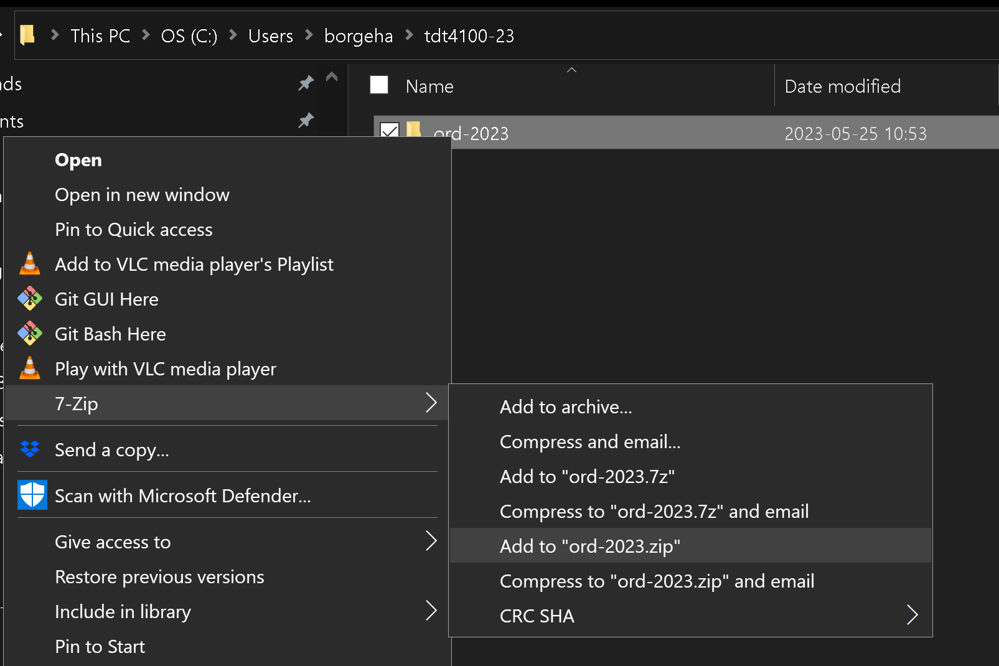

# Eksamen sommar K2023

Oppgaven består av følgjande delar, som ligg inne i kvar sin pakke.

Eksamen er delt opp i ni delar. Dei ulike delane tel ulikt inn ved berekning av sluttskår. Me reserverer for oss retten til å justera denne vektinga i vurderingsprosessen.

- [Del 1](src/main/java/part1/part1.md) - 10 %
- [Del 2](src/main/java/part2/part2.md) - 12.5 %
- [Del 3](src/main/java/part3/part3.md) - 15 %
- [Del 4](src/main/java/part4/part4.md) - 10 %
- [Del 5](src/main/java/part5/part5.md) - 12.5 %
- [Del 6](src/main/java/part6/part6.md) - 10 %
- [Del 7](src/main/java/part7/part7.md) - 10 %
- [Del 8](src/main/java/part8/part8.md) - 10 %
- [Del 9](src/main/java/part9/part9.md) - 10 %

## Oppgaveformat

Oppgavebeskrivelsene finn de under kvar del. Det vil seia at src/main/java/part1/part1.md inneheld oppgåveskildringa for del 1.

Rolla til dei ulike klassane blir først skissert saman med oppgåveteksten
Alle klassane er ferdig oppretta, og kan innehalda både ferdiglaga metodar og metodar de skal fylla inn.
Det er markert med TODO-kommentarar der de må må fylla inn eigen kode.
Evt. **return*-setningar er med for å unngå kompileringsfeil, og må også endrast.
Merk at det kan vera nødvendig å leggja til annan kode òg, avhengig av val dere sjølv tek.
Nokre av klassane har main-metoder, som er meint å hjelpa dykk å testa klassane manuelt. Det er ikkje gitt at alle metodar/tilfelle av åtferd er testa i denne, og de blir oppmoda om de har tid til å testa eigne tilfelle.

Ytterlegare informasjon kan stå i javadoc-en, som er kommentarar som står før klassedeklarasjonen og metodane i kjeldekoden.
Det er generelt lurt å sjå gjennom klassane for å få oversikt over kva som er implementert ferdig og kva som manglar!

Klassane implementerer gjerne eit `Interface` eller bruker eksisterande klassar som ligg i **shared/**. Desse klassane **skal ikkje** endrast på. Interfacene som ligg der er for å gjera det lettare å testa koden deira. Ingenting i **shared/** skal endrast på.

De kan bruka .md-filene til å navigera filane/klassane som faktisk skal implementerast.
Dersom du meiner at Javadoc og oppgåveskildring inneheld motstridande informasjon, følg Javadoc og skriv ein kommentar om dette  [oppgåvekommentarar](oppgåvekommentarar.md), og så utfør oppgåva slik du meiner gir best meining. Prøv alltid å følgja Javadoc on du meiner det blir gitt motstridande informasjon.

I oppgåver der unntak skal utløysast treng du ikkje bruka tid på spesifisera ei melding. Til dømes *new IllegalArgumentException()* held i massevis.

Viss du ikkje skulle klara å implementera ein metode i del A kan du sjølvsagt bruka denne vidare i del B, som om del A verka, og kunne skåra fulle poeng i del B. Du vil derimot ikkje kunna få den same støtta ved køyring av seinare main-metoder som om del A verka perfekt. 

Merk at metoden bør framleis kompilera, alle metodar kompilerer ved hjelp av *dummy* return verdiar, som er verdiar av rett type, men ikkje korrekte.

Kode som ikkje kompilerer kan gi noko utteljing, avhengig av alvorsgrada til feila. Du vil derimot *aldri* få like mange poeng som om koden faktisk hadde kompilert, så forsøk etter beste evne å gjere det. 

Unntak i koden som NullPointerException er ikkje kompileringsproblem (men vil sjølvsagt ikkje gi full poengsum). De bør testa dykkar eigen kode slik at de veit at denne køyrer. For å hjelpa med dette har dei fleste deloppgåver ein 'main-metode' som inneheld noko kode for å testa implementeringa. Desse main-metodene testar ikkje nødvendigvis alle tilfelle (ho er ikkje ein kravspesifikasjon for klassen!) så du blir oppmoda til å utvida med dine eigne testar. Denne koden bør framleis kompilera, men treng ikkje fjernast ved levering.

## Navigering

Oppgavebeskrivelsene kan brukast til å navigera til rette filer. Når du har opna ein .md-fil kan du trykkja på **Preview**-ikon for å få dette på ein meir leseleg måte. Det kan du også få ved å høyreklikke på .md-filen i utforskaren. Alternativt høgreklikkar du på fil.md og vel 'Open preview'.

Alle metodane de skal fylla inn er og markerte med `// TODO`.
Desse kan du få ei oversikt over i VSCode med Ctrl + Shift + F (søk i heile opne mappe)

## Besvarelse

Oppgaveteksten finnast i  **partx.md**-filer og andre md-filer i prosjektet og kan lesast både på gitlab og i IDE-en. Versjonar på nynorsk og engelsk finst i eigne filer.

Oppgåva *blir svart på* ved å byggja vidare på kode-filene som er der, og fylla inn evt antakingar du gjer, i den separate md-filen **oppgavekommentarer.md**.

## Etter at zipfilen er pakka ut

Etter at du har lasta ned zip-fil frå Inspera, så unzip denne inni mappa C:\temp\. Dette gir ei mappe som heiter **kont-2023**. Prosjektkatalogen skal altså enda opp som `C:\temp\kont-2023`.

### For Visual Studio Code

Gå så inn i VSCode, og gå til File -> Open Folder. Eit filnavigeringsvindauge blir opna. Finn fram til mappa du unzippet (**kont-2023**), og vel denne.
VSCode vil då, pga. POM-fila som ligg i mappa, automatisk finna ut at dette er eit Maven Java-prosjekt. (Under føresetnad at Java-utvidinga er installert i VSCode.)

## Spesialteikn i Windows: teikn som alfakrøll, [], {}, |

I Windows legg ein inn desse på ein litt annan måte enn i OS X! Alle kan sjåast på tastaturet, viss teikna står nedst til høgre på tasten får ein det gjennom å halda inn alt-gr (tasten til høgre for mellomrom) samtidig med tasten med teiknet.

- | er øvst til venstre
- @ er alt-gr og 2
- [,] er alt-gr  og 8,9
- {,} er alt-gr og 7, 0

## Levering

Når eksamen skal leverast kan du gjera dette på denne måten:
Kortform: Den same mappa som du pakka ut, den skal du pakka inn i `.zip`-format.

- Viss du ikkje har ein utforskarmeny til venstre: høgreklikk på ikonet for 'Explorer' øvst til venstre (to papirark oppå kvarandre)
- Klikk i eit tomt område i VSCodes 'Explorer'.
- Vel 'Reveal in File Explorer' (Windows)
- Du skal no få opp eit utforskarvindauge (i Windows) som skal innehalda den foldaren du pakka ut. Denne foldaren inneheld prosjektfoldaren me skal komprimera: `C:\temp\kont-2023`.
- Høgreklikk på denne foldaren -> 7-zip -> Add to "kont-2023.zip"
- Denne zipfilen er fila de skal lasta opp til Inspera til slutt.
- De finn eit par bilete av prosessen til slutt i denne fila (med andre mappenavn).

**Visual Studio Code Explorer*

**Compress*

