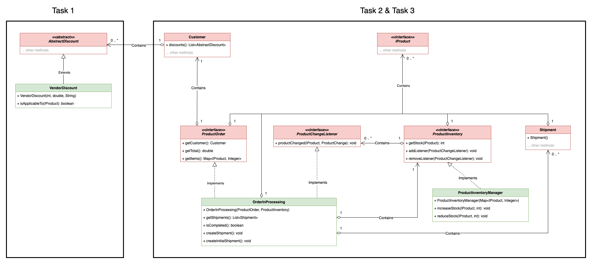

# Del 5 (20 %)

Relevante søkeord:

* Observatør/observert-teknikk
* Delegering
* Abstrakte klasser

## Kontekst – Et Proof-of-Concept av et ordrebehandlingssystem for økt salg

ShopStore.com ønsker å teste ut noen nye funksjoner for å øke salget. Blant disse er en ny type leverandørrabatt som gir rabatter på alle produkter fra en spesifikk leverandør, samt en ny ordrehåndteringsprosess som tillater delvis og dynamisk forsendelse av produkter i en bestilling, basert på gjeldende lagertilgjengelighet.

Nedenfor er UML-klassediagrammet for denne delen. Klassene i RØDT er gitt.
Klassene i GRØNT er de du må implementere. For å forenkle diagrammet, har noen irrelevante metoder blitt skjult.

## Oppgave 1

Implementer klassen [VendorDiscount](VendorDiscount.java).

## Oppgave 2

Implementer klassen [ProductInventoryManager](ProductInventoryManager.java) som implementerer ProductInventory-grensesnittet.

## Oppgave 3

Implementer klassen [OrderInProcessing](OrderInProcessing.java), som bruker ProductInventory-grensesnittet, implementert i oppgave 2.

# Enhetstester

Et komplett sett med enhetstester er levert for å støtte deg for denne delen.

* [Tester for VendorDiscount](../../../../../../test/java/com/shopstore/retail/part5/VendorDiscountTest.java)
* [Tester for ProductInventoryManager](../../../../../../test/java/com/shopstore/retail/part5/ProductInventoryManagerTest.java)
* [Tests for OrderInProcessing](../../../../../../test/java/com/shopstore/retail/part5/OrderInProcessingTest.java)